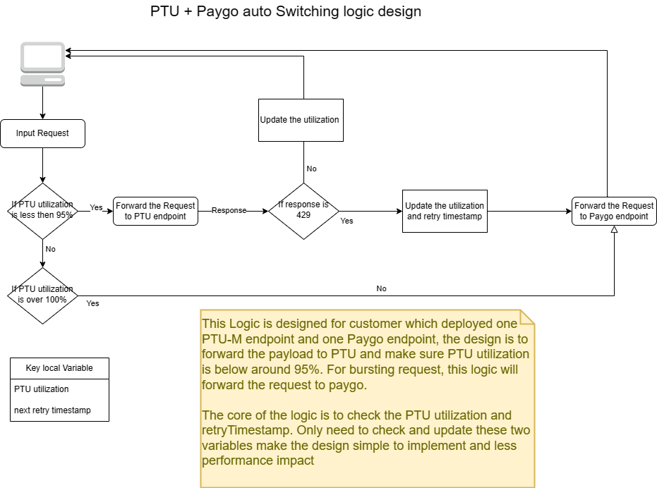

# apim-aoai-ptu-paygo-auto-switching
This repo is created to try to implement the Azure APIM policy to automatically switching AOAI PTU to Paygo when AOAI PTU utilization is reaching a threshold(example 90%). Following is the Diagram to try to be implemented.
